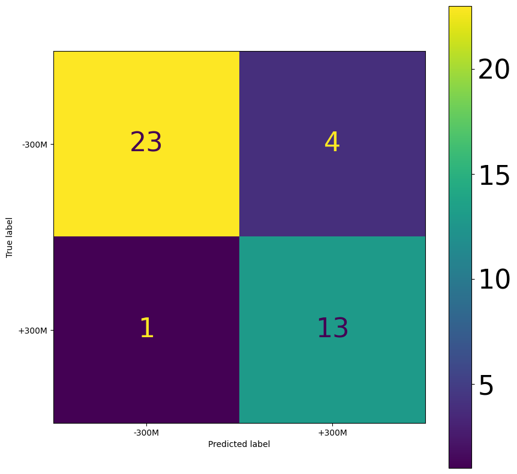

# Views Predictor Project

This repo contains the code to analyze songs (better if they are from the same artists, they are more homogeneus) and train a model, a ResNet by default, to predict if they will surpass a thrashold of views or not (basically if they will become popular).

 
 
<!-- TABLE OF CONTENTS -->
  ### Table of contents
  <ol>
    <li>
      <a href="#my_test">My test</a>
      <ul>
        <li><a href="#results_on_validation_set">Results on Validation set</a></li>
        <li><a href="#results_on_test_set">Results on Test set</a></li>
      </ul>
    </li>
  </ol>

 

## My test
The project has been test with 63 songs of Bad Bunny setting a threshold of 300.000 views, using these configurations:
 <ol>
    <li>Sample Rate: 44.1 kHz</li>
    <li>Lenght of sample: 15sec</li>
    <li>Number of samples per song: 4</li>
    <li>Model: ResNet</li>
    <li>Number of epochs: 50</li>
  </ol>

### Results on Validation set
The results obtained in the Validation set are shown in this matrix:

 

### Results on Test set
Then I tested the model in the Test set, made by 

 
 

## Contacts
Matteo Zaramella - matteozara98@gmail.com

 
 
